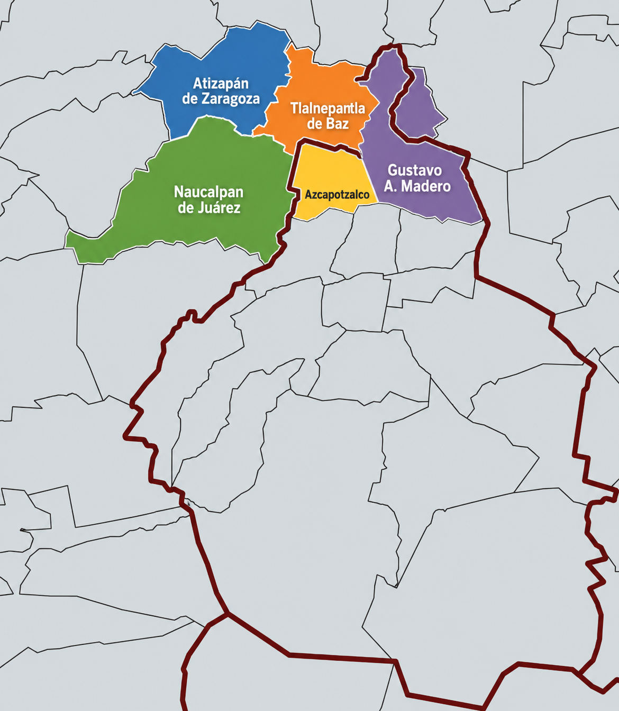

# Apartment Price Analysis in the Northwestern Metropolitan Area

## Overview

This project analyzes apartment listings for sale across the Northwestern Metropolitan Area of Greater Mexico City, focusing on **Atizapán de Zaragoza, Tlalnepantla de Baz, Naucalpan de Juárez, Azcapotzalco, and Gustavo A. Madero**.

  

https://northwestern-apartment-price-analysis.onrender.com/

The objective is to explore how apartment prices vary across municipalities and how factors such as **property size, number of bedrooms, and number of bathrooms** are associated with asking prices.

The project combines data cleaning, exploratory data analysis, statistical analysis, and data visualization to identify patterns and differences in the local apartment market.

## Research Questions

The analysis seeks to answer questions such as:

- How do apartment prices differ across municipalities?
- Which municipality has the highest and lowest median apartment price?
- How does apartment size relate to asking price?
- What is the relationship between price per square meter and location?
- How do the number of bedrooms and bathrooms relate to apartment prices?
- Which areas offer the greatest amount of floor space relative to price?
- Are there significant differences in apartment prices between municipalities?

## Dataset

The dataset contains **2,431 apartment listings** 

## Data Source

The dataset was collected through web scraping of apartment listings published on Mercado Libre.

**Source:** Mercado Libre  
**Collection method:** Web scraping  
**Dataset size:** 2,431 apartment listings  
**Property type:** Apartments for sale  
**Geographic scope:** Northwestern Metropolitan Area of Greater Mexico City

The scraping process was designed to extract relevant listing attributes, including asking price, location, surface area, bedrooms, bathrooms, and listing URLs.

Because real-estate listings are dynamic and may be updated, removed, or duplicated over time, the dataset should be interpreted as a snapshot of the advertised market at the time of collection.

### Variables

| Variable | Description |
|---|---|
| `titulo` | Title of the property listing |
| `precio` | Asking price of the apartment |
| `moneda` | Currency of the listing |
| `ubicacion` | Detailed property location |
| `superficie` | Built area in square meters |
| `recamaras` | Number of bedrooms |
| `banos` | Number of bathrooms |
| `link` | URL of the original listing |
| `imagen` | Property image URL |
| `municipio` | Municipality or borough where the property is located |

## Geographical Scope

This analysis focuses on a selected group of municipalities and boroughs located in the **northwestern sector of the Greater Mexico City metropolitan area**.

The study covers:

- **Naucalpan de Juárez**
- **Atizapán de Zaragoza**
- **Tlalnepantla de Baz**
- **Azcapotzalco**
- **Gustavo A. Madero**

The study area spans both the **State of Mexico (Estado de México)** and **Mexico City (CDMX)**, capturing a continuous metropolitan area with strong residential, commercial, and commuting connections.

This geographic scope was selected to examine differences in apartment asking prices across neighboring jurisdictions and to explore how location and property characteristics relate to real-estate prices within this sector of the metropolitan area.

## Limitations

Several limitations should be considered when interpreting the results:

- The dataset contains asking prices rather than final transaction prices.
- The data represents listings available at the time of collection.
- Online listings may contain inaccurate or incomplete information.
- Some properties may appear more than once across listings.
- The dataset does not necessarily represent the entire apartment market in the study area.
- Asking prices may differ from actual selling prices.